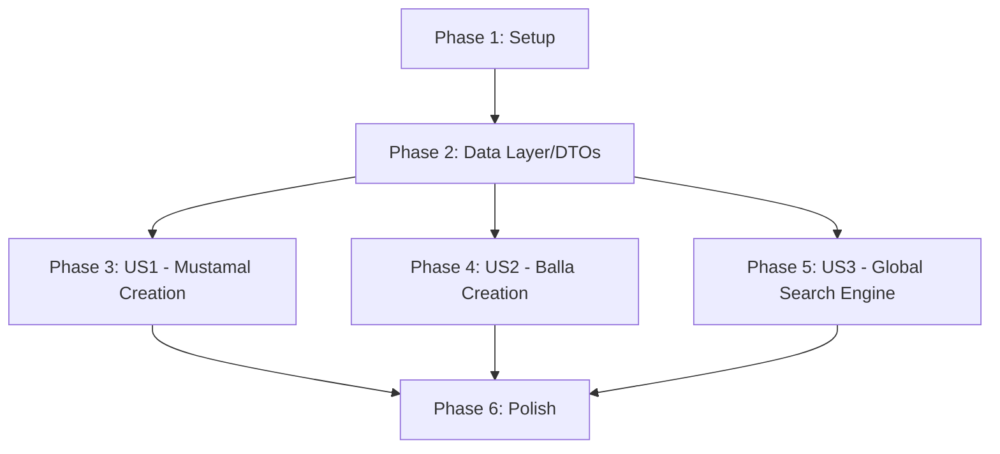

# Tasks: Supply Forms and Global Search

**Feature**: `004-supply-and-search`
**Branch**: `004-supply-and-search`
**Spec**: [spec.md](./spec.md)
**Plan**: [plan.md](./plan.md)
**Generated**: 2026-03-09

---

## Format: `[ID] [P?] [BLoC|RTL|DI|PERF] [Story] Description`

- **[P]**: Can run in parallel (different files, no shared state dependencies)
- **[Story]**: Which user story this task belongs to (US1–US3 per spec scenarios)
- **[BLoC]**: BLoC/Cubit class or state definition
- **[RTL]**: RTL layout, ARB localisation string, or IQD formatting
- **[DI]**: DI registration / `build_runner` re-generation
- **[PERF]**: Performance: image caching, pagination, const constructors
- **[TEST]**: Test file (unit, widget, bloc_test)

---

## Phase 1: Setup

**Purpose**: Scaffold file structures and add any required UI masonry grid packages (if missing from pubspec).

- [ ] T001 Add `flutter_staggered_grid_view` dependency to `pubspec.yaml` (if not already present).
- [ ] T002 Setup the `search` domain folder structure in `lib/features/search/` (data, domain, presentation).

---

## Phase 2: Foundational Data Layer

**Purpose**: Create missing DTO classes and configure the search repository infrastructure.

- [ ] T003 [P] Define `CreateMustamalRequest` DTO in `lib/features/shop/data/models/shop_models.dart`. Include exact fields defined in the plan: `title`, `description`, `price`, `categoryId`, `condition`, and `images`. Assume `listing_type = 'fixed_price'` in its `toJson()`.
- [ ] T004 [P] Define `CreateBallaRequest` DTO in `lib/features/shop/data/models/shop_models.dart`. Include standard fields plus `salesUnit` and `weight`. Assume `is_balla = true` in its `toJson()`.
- [ ] T005 [P] Create `SearchRemoteDataSource` in `lib/features/search/data/datasources/search_remote_data_source.dart` defining a GET to `ApiConstants.search` using `?q=query`.
- [ ] T006 [P] Create `SearchRepositoryImpl` in `lib/features/search/data/repositories/search_repository_impl.dart`.
- [ ] T007 [DI] Run `dart run build_runner build --delete-conflicting-outputs` to process the newly annotated `freezed`/`json_serializable` classes and injectables.

---

## Phase 3: User Story 1 — Mustamal Creation Flow

**Story Goal**: Implement the end-to-end functionality for users submitting a C2C listing.
**Test Criteria**: User can successfully post an item visually through `create_mustamal_page.dart` and see a Snackbar output on success.

- [ ] T008 [US1] Extend `ItemRemoteDataSource` or `ShopRemoteDataSource` (wherever applicable, likely `lib/features/shop/data/datasources/shop_remote_datasource.dart`) to implement `createMustamalListing(CreateMustamalRequest req)`.
- [ ] T009 [US1] [BLoC] Create `CreateMustamalCubit` in `lib/features/home/presentation/bloc/create_mustamal_cubit.dart` controlling the 2-step process: Uploading images via `MediaRemoteDataSource` -> Submitting `CreateMustamalRequest`.
- [ ] T010 [US1] Modify `lib/features/home/presentation/pages/create_mustamal_page.dart`. Wrap the submit button with a `BlocConsumer`, display a blocking loading overlay when active, trigger `CreateMustamalCubit.submit()`, and handle success (`context.pop()`) and error (`ScaffoldMessenger`) state listening natively.

---

## Phase 4: User Story 2 — Balla Creation Flow

**Story Goal**: Allow wholesale merchants to list B2B Balla bundles with proper image handling and specific units.
**Test Criteria**: Form submission hits backend APIs seamlessly and navigates the user backward with a green popup state.

- [ ] T011 [US2] Extend the remote data source (e.g. `ShopRemoteDataSource`) in `lib/features/shop/data/datasources/shop_remote_datasource.dart` to implement `createBallaListing(CreateBallaRequest req)`.
- [ ] T012 [US2] [BLoC] Create `CreateBallaCubit` in `lib/features/home/presentation/bloc/create_balla_cubit.dart` mirroring the 2-step image-upload and model creation pattern.
- [ ] T013 [US2] Modify `lib/features/home/presentation/pages/add_balla_page.dart` to invoke the `CreateBallaCubit`. Inject UI loading overlays and state listeners correctly.

---

## Phase 5: User Story 3 — Global Discovery (Search) UI

**Story Goal**: Replace the dead search route with a live, debounced, masonry grid search capable of rendering everything.
**Test Criteria**: User typing "iPhone" shows a 400ms loading spinner then renders the resulting products polymorphic array.

- [ ] T014 [US3] [BLoC] Implement `SearchCubit` in `lib/features/search/presentation/bloc/search_cubit.dart`. Implement a delayed Timer (400ms) or `rxdart` Debouncer to dispatch the query strings to the newly constructed `SearchRemoteDataSource`.
- [ ] T015 [US3] [RTL] Build `SearchPage` in `lib/features/search/presentation/pages/search_page.dart`. Ensure the top features an auto-focused `TextField` and the body implements `SliverMasonryGrid.count()`. Map raw responses conditionally back into existing UI widgets (e.g., `_ProductCard`, `_AuctionCard`).
- [ ] T016 [US3] Wire `SearchPage` into `lib/core/router/app_router.dart` inside the `GoRoute(path: '/search')`, replacing `<Placeholder>`. Wrap it in a `BlocProvider<SearchCubit>(create: (c) => getIt<SearchCubit>())`.

---

## Phase 6: Polish & Performance

**Purpose**: Code quality audits and constitution verification.

- [ ] T017 [PERF] Add `const` modifiers anywhere they represent static widgets in `search_page.dart`, `create_mustamal_page.dart`, and `add_balla_page.dart`.
- [ ] T018 Run `dart format .` and `flutter analyze` ensuring zero warnings are introduced.

---

## Dependency Graph

## Parallel Execution Opportunities

- After Phase 2 concludes, the structural backend API bounds are securely tied.
- **T008-T010 (US1)**, **T011-T013 (US2)**, and **T014-T016 (US3)** can all perfectly be executed by 3 independent developers in entirely distinct contexts without disrupting cross-code.

## Implementation Strategy

1. **Foundations (MVP Layers)**: Nail down the `freezed` mappings to ensure JSON encoding rules match exactly.
2. **Global Search**: Usually the highest impact for retention. Building the Search Matrix should be prioritized.
3. **Creation Forms (Balla & Mustamal)**: Wrapping existing UIs iteratively to allow data intake.
4. **Final Refinements**: Enforcing debouncing delays and loading interactions.
