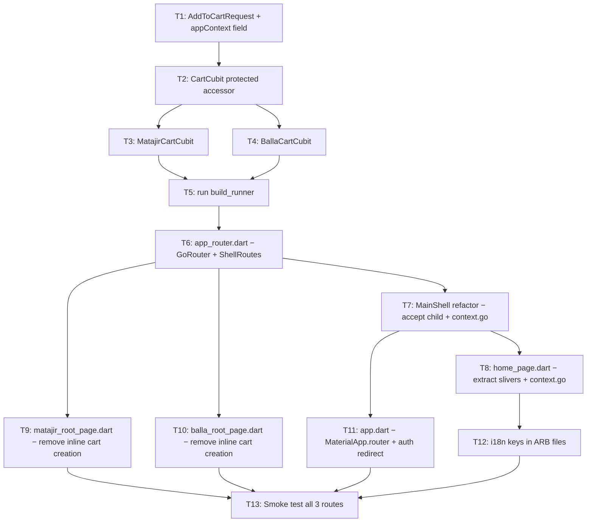

# Implementation Plan — Super App Portal Refactor
> Generated: 2026-03-06 | Branch target: `feat/super-app-portal`

---

## 1. Technical Context

| Dimension | Current State | Target State |
|---|---|---|
| **Routing** | `MaterialApp(home: MainShell)` — all pages navigated via `Navigator.push` | `MaterialApp.router` with `go_router ^17` — named routes, Mini-App shells |
| **Home Page** | `CustomScrollView` + Slivers already in place (partial) | Fully extracted sliver widgets, i18n strings, `Directionality`-aware layout |
| **Cart State** | Single global `CartCubit` in `App` tree + `ScopedCartCubit` per Mini-App page | Dedicated typed cubits `MatajirCartCubit` & `BallaCartCubit`; `app_context` in every API payload |
| **Mini-App Frames** | `MatajirPage` / `BallaPage` build their own `SliverAppBar` inline | `ShellRoute` in go_router wraps each Mini-App with its localized `AppBar` + scoped `CartCubit` |
| **Global AppBar** | `MainShell` has no AppBar (glass nav pill only) | Preserved — Mini-App routes replace the shell entirely, so the global nav pill is hidden |
| **i18n** | Most home strings are Arabic literals | All user-facing strings extracted to `app_en.arb` / `app_ar.arb` |

---

## 2. Constitution Check

> _No constitution.md found in `.specify/` — using project-level principles inferred from codebase._

| Principle | Status |
|---|---|
| Glassmorphism / premium aesthetic | ✅ Must be preserved in all new/changed UI |
| Optimistic UI for cart mutations | ✅ Keep existing pattern |
| Offline-first optimistic cart | ✅ Keep `_remote?.ignore()` pattern |
| `getIt` for DI | ✅ All new cubits registered via `@injectable` |
| RTL / Cairo font | ✅ All new widgets must use `GoogleFonts.cairo()` |
| `flutter_screenutil` `.w / .h / .sp / .r` | ✅ All sizing must use screenutil |

---

## 3. Phase 0 — Research & Decision Log

### 3.1 go_router Shell Pattern

**Decision:** Use `ShellRoute` (not `StatefulShellRoute`) for Mini-App frames.

**Rationale:** Each Mini-App (`/matajir`, `/balla`) is a full-screen replacement of the Super App shell — there is no persistent state between visits (no bottom-tab switching). `ShellRoute` wraps a subtree in a navigator and provides the frame (AppBar + scoped BlocProvider) without maintaining tab state across routes.

**Pattern chosen:**
```
GoRouter
├── / (MainShell → IndexedStack)
│   ├── /home          → HomePage
│   ├── /messages      → MessagesPage
│   ├── /activity      → ActivityPage
│   └── /profile       → ProfilePage
├── ShellRoute (MatajirShell) path: /matajir
│   ├── /matajir              → MatajirRootPage
│   └── /matajir/shop/:slug   → ShopProductsPage
└── ShellRoute (BallaShell) path: /balla
    └── /balla                → BallaRootPage
```

**Alternatives considered:**
- `StatefulShellRoute` — overkill; would maintain tab branch state across navigations unnecessarily.
- Keeping `Navigator.push` — blocks go_router deep linking and Announcement `deepLink` resolving.

### 3.2 Distinct Cubits vs Single Parameterised Cubit

**Decision:** Create explicit `MatajirCartCubit` and `BallaCartCubit` subclasses of `ScopedCartCubit` rather than using a factory method.

**Rationale:**
- Each cubit becomes a unique DI type, allowing `context.read<MatajirCartCubit>()` with type safety — no possibility of reading the wrong cubit from the wrong Mini-App subtree.
- Avoids the "magic string" risk of `CartAppContext.matajir` being passed to the wrong widget.
- Makes the `ShellRoute` builder clean: just `BlocProvider(create: (_) => getIt<MatajirCartCubit>())`.

**Payload contract:** `AddToCartRequest` gains an `appContext` field that maps to `"app_context"` in JSON. This is the single change required on the backend contract side.

### 3.3 SliverAppBar Pinning Strategy for home_page

**Decision:** Keep the `SliverAppBar` as-is structurally; extract all inline widgets into private `const` widget classes for testability. Add `floating: false, snap: false, pinned: true` explicitly.

**Rationale:** The home page already has the sliver scaffolding working correctly. The main gap is extracting the large `_buildSliverAppBar()` method body into `_HomeAppBar`, `_AnnouncementsCarousel`, `_BentoGrid`, and section-header widgets as standalone classes so that individual Slivers can be tested in isolation and the `build()` method becomes a clean `slivers: [...]` list.

---

## 4. Phase 1 — Data Model Changes

### 4.1 `AddToCartRequest` — add `app_context` field

**File:** `lib/features/cart/data/models/cart_models.dart`

```dart
// BEFORE
class AddToCartRequest {
  final String itemType;
  final String referenceId;
  final int quantity;
  ...
  Map<String, dynamic> toJson() => {
    'item_type': itemType,
    'reference_id': referenceId,
    'quantity': quantity,
  };
}

// AFTER
class AddToCartRequest {
  final String itemType;
  final String referenceId;
  final int quantity;
  final String? appContext; // 'matajir' | 'balla' | null (global)

  ...
  Map<String, dynamic> toJson() => {
    'item_type': itemType,
    'reference_id': referenceId,
    'quantity': quantity,
    if (appContext != null) 'app_context': appContext,
  };
}
```

> [!IMPORTANT]
> `if (appContext != null)` omits the field entirely for the legacy global `CartCubit`, preserving backward compatibility. The backend must handle the absence of `app_context` as a global/unscoped cart item.

### 4.2 New Cubit Files

Create **two new files** in `lib/features/cart/presentation/cubit/`:

```
lib/features/cart/presentation/cubit/
├── matajir_cart_cubit.dart   ← NEW
└── balla_cart_cubit.dart     ← NEW
```

> [!NOTE]
> The existing `cart_cubit.dart` and `cart_context.dart` stay in `presentation/bloc/`. The new typed cubits live in the sibling `cubit/` directory to clearly separate scoped Mini-App state from the global cart state.

### 4.3 `MatajirCartCubit`

**File:** `lib/features/cart/presentation/cubit/matajir_cart_cubit.dart`

```dart
import 'package:injectable/injectable.dart';
import '../../../cart/data/datasources/cart_remote_data_source.dart';
import '../../../cart/data/models/cart_models.dart';
import '../bloc/cart_context.dart';
import '../bloc/cart_cubit.dart';

/// Isolated cart for the Matajir (B2C Retail) Mini-App.
///
/// Every [addToCart] call sends `app_context: 'matajir'` in the
/// backend payload, keeping Matajir items strictly segregated at
/// the API level.
@injectable
class MatajirCartCubit extends ScopedCartCubit {
  MatajirCartCubit(CartRemoteDataSource? remote)
      : super(CartAppContext.matajir, remote);

  @override
  void addToCart(ProductModel product) {
    // 1. Optimistic local update (identical to base behaviour)
    final items = List<CartItem>.from(state.cartItems);
    final idx = items.indexWhere((i) => i.product.id == product.id);

    if (idx >= 0) {
      final newQty = items[idx].quantity + 1;
      items[idx] = items[idx].copyWith(quantity: newQty);
      emit(state.copyWith(cartItems: items));

      final cartItemId = items[idx].cartItemId;
      if (_remote != null && cartItemId != null) {
        _remote
            .updateCartItem(cartItemId,
                UpdateCartQuantityRequest(quantity: newQty))
            .ignore();
      }
    } else {
      items.add(CartItem(product: product));
      emit(state.copyWith(cartItems: items));

      // 2. POST with app_context: 'matajir'
      _remote
          ?.addToCart(AddToCartRequest(
            itemType: '${appContext.apiValue}_product', // 'matajir_product'
            referenceId: product.id,
            quantity: 1,
            appContext: appContext.apiValue,             // 'matajir'
          ))
          .then((serverItem) {
            final updated = List<CartItem>.from(state.cartItems);
            final i = updated.indexWhere((c) => c.product.id == product.id);
            if (i >= 0) {
              updated[i] = updated[i].copyWith(cartItemId: serverItem.id);
              emit(state.copyWith(cartItems: updated));
            }
          })
          .catchError((_) {});
    }
  }
}
```

> [!NOTE]
> `_remote` is `private` to `CartCubit`. The override either re-exposes it via a protected accessor on `ScopedCartCubit`, **or** the cubit is designed as a full standalone (not subclassing `CartCubit`). Preferred: add `@protected CartRemoteDataSource? get remote => _remote;` to `CartCubit`.

### 4.4 `BallaCartCubit`

**File:** `lib/features/cart/presentation/cubit/balla_cart_cubit.dart`

Identical pattern to `MatajirCartCubit`, with:
- `CartAppContext.balla`
- `itemType: 'balla_product'`
- `appContext: 'balla'`

### 4.5 DI Registration

**File:** `lib/core/di/register_module.dart` (or add `@injectable` annotations)

```dart
// Both new cubits need CartRemoteDataSource injected
// Add to injection.config.dart (run `dart run build_runner build`)

@injectable
class MatajirCartCubit extends ScopedCartCubit { ... }

@injectable  
class BallaCartCubit extends ScopedCartCubit { ... }
```

After adding `@injectable` annotations, regenerate:
```bash
dart run build_runner build --delete-conflicting-outputs
```

---

## 5. Phase 2 — `home_page.dart` Sliver Refactor

### 5.1 Current State

`home_page.dart` already uses `CustomScrollView` + `slivers: [...]`. The issues are:
1. Inline `build()` method builds all slivers in one monolithic method (1034 lines).
2. Navigation still uses `Navigator.push(MaterialPageRoute(...))` — must migrate to `context.go('/matajir')`.
3. All user-visible strings are Arabic literals, not i18n keys.
4. `Timer`-based announcement carousel is in `_HomePageState` — correctly placed, but `PageController` lifetime should be scoped to a `_AnnouncementsCarouselState`.

### 5.2 Extraction Plan

Extract the following **private widget classes** (all `StatelessWidget` unless noted):

| Extracted Widget | Type | Replaces |
|---|---|---|
| `_HomeAppBar` | `StatelessWidget` → yields `SliverAppBar` | `_buildSliverAppBar()` |
| `_AnnouncementsCarousel` | `StatefulWidget` (owns `PageController` + `Timer`) | `_buildAnnouncementsCarousel()` |
| `_BentoGrid` | `StatelessWidget` | `_buildBentoGrid()` |
| `_SectionList<T>` | `StatelessWidget` (generic) | All `_buildXxxHorizontalList()` |
| `_SectionHeader` | Already extracted ✅ | — |
| `_AuctionCard` | `StatelessWidget` | inline auction card |
| `_ProductCard` | `StatelessWidget` | inline product card |
| `_MustamalCard` | `StatelessWidget` | inline mustamal card |

### 5.3 Updated `build()` skeleton

```dart
@override
Widget build(BuildContext context) {
  return BlocProvider.value(
    value: _cubit,
    child: Scaffold(
      backgroundColor: AppTheme.background,
      body: SafeArea(
        child: BlocBuilder<HomeCubit, HomeState>(
          builder: (context, state) {
            if (state.isLoading && state.liveAuctions.isEmpty) {
              return const Center(
                child: CircularProgressIndicator(color: AppTheme.primary),
              );
            }
            return RefreshIndicator(
              color: AppTheme.primary,
              backgroundColor: AppTheme.surface,
              onRefresh: () => _cubit.loadFeed(),
              child: CustomScrollView(
                physics: const AlwaysScrollableScrollPhysics(),
                slivers: [
                  // 1. Pinned App Bar — brand + escrow wallet + omnibox
                  const _HomeAppBar(),

                  // 2. Announcements Carousel
                  if (state.announcements.isNotEmpty)
                    SliverToBoxAdapter(
                      child: _AnnouncementsCarousel(
                        announcements: state.announcements,
                      ),
                    ),

                  // 3. Bento Grid — 4 Mini-Apps
                  const SliverToBoxAdapter(child: _BentoGrid()),

                  // 4a. Trending Auctions
                  if (state.liveAuctions.isNotEmpty) ...[
                    _SectionHeader(
                      titleKey: 'homeSectionAuctions',  // i18n key
                      moreKey: 'seeAll',
                      onMore: () => context.go('/mazadat'),
                    ),
                    SliverToBoxAdapter(
                      child: _SectionList<AuctionModel>(
                        items: state.liveAuctions,
                        itemBuilder: (_, a) => _AuctionCard(auction: a),
                      ),
                    ),
                  ],

                  // 4b. New in Matajir
                  if (state.featuredProducts.where((p) => !p.isBalla).isNotEmpty) ...[
                    _SectionHeader(
                      titleKey: 'homeSectionMatajir',
                      moreKey: 'shopAll',
                      onMore: () => context.go('/matajir'),
                    ),
                    SliverToBoxAdapter(
                      child: _SectionList<ProductModel>(
                        items: state.featuredProducts.where((p) => !p.isBalla).toList(),
                        itemBuilder: (_, p) => _ProductCard(product: p, badge: 'matajir'),
                      ),
                    ),
                  ],

                  // 4c. Mustamal Steals
                  if (state.portal.mustamal.isNotEmpty) ...[
                    _SectionHeader(titleKey: 'homeSectionMustamal', moreKey: 'seeAll', onMore: () => context.go('/mustamal')),
                    SliverToBoxAdapter(child: _SectionList<ItemModel>(items: state.portal.mustamal, itemBuilder: (_, i) => _MustamalCard(item: i))),
                  ],

                  // 4d. Balla Steals
                  if (state.portal.balla.isNotEmpty) ...[
                    _SectionHeader(titleKey: 'homeSectionBalla', moreKey: 'shopAll', onMore: () => context.go('/balla')),
                    SliverToBoxAdapter(child: _SectionList<ProductModel>(items: state.portal.balla, itemBuilder: (_, p) => _ProductCard(product: p, badge: 'balla'))),
                  ],

                  // Bottom padding — clear glass nav pill
                  SliverToBoxAdapter(child: SizedBox(height: 110.h)),
                ],
              ),
            );
          },
        ),
      ),
    ),
  );
}
```

### 5.4 `_BentoGrid` go_router navigation

```dart
// BEFORE (in _buildBentoGrid)
onTap: () => Navigator.push(context, MaterialPageRoute(builder: (_) => const MatajirPage())),

// AFTER
onTap: () => context.go('/matajir'),
```

### 5.5 i18n Keys to Add

Add to `lib/l10n/arb/app_en.arb` and `app_ar.arb`:

| Key | EN | AR |
|---|---|---|
| `homeSectionAuctions` | Live Auctions 🔴 | مزادات الساعة 🔴 |
| `homeSectionMatajir` | New in Stores 🏬 | جديد في المتاجر 🏬 |
| `homeSectionMustamal` | Mustamal Deals 🤝 | صفقات المستعمل 🤝 |
| `homeSectionBalla` | Balla Treasures 📦 | كنوز البالة 📦 |
| `seeAll` | See All | الكل |
| `shopAll` | Shop All | تسوق الكل |
| `walletBalance` | Balance: {amount} | الرصيد: {amount} |
| `omniboxHint` | What are you looking for today? | على شنو تدور اليوم؟ |

---

## 6. Phase 3 — go_router Integration

### 6.1 Create `AppRouter`

**New file:** `lib/core/router/app_router.dart`

```dart
import 'package:flutter/material.dart';
import 'package:flutter_bloc/flutter_bloc.dart';
import 'package:go_router/go_router.dart';

import '../../features/cart/data/datasources/cart_remote_data_source.dart';
import '../../features/cart/presentation/cubit/balla_cart_cubit.dart';
import '../../features/cart/presentation/cubit/matajir_cart_cubit.dart';
import '../../features/home/presentation/pages/home_page.dart';
import '../../features/shop/presentation/pages/matajir_page.dart';
import '../../features/shop/presentation/pages/balla_page.dart';
import '../../features/shop/presentation/pages/shop_products_page.dart';
import '../widgets/main_shell.dart';
import '../di/injection.dart';

final appRouter = GoRouter(
  initialLocation: '/',
  routes: [
    // ── Super App Shell ──────────────────────────────────────────────────
    ShellRoute(
      builder: (context, state, child) => MainShell(child: child),
      routes: [
        GoRoute(path: '/',     builder: (_, __) => const HomePage()),
        GoRoute(path: '/messages',  builder: (_, __) => const MessagesPage()),
        GoRoute(path: '/activity',  builder: (_, __) => const ActivityPage()),
        GoRoute(path: '/profile',   builder: (_, __) => const ProfilePage()),
      ],
    ),

    // ── Matajir Mini-App Shell ───────────────────────────────────────────
    ShellRoute(
      builder: (context, state, child) {
        // Provide scoped cart — hidden from the global MainShell tree
        return BlocProvider<MatajirCartCubit>(
          create: (_) => MatajirCartCubit(getIt<CartRemoteDataSource>()),
          child: child,  // child is already a full-screen Scaffold
        );
      },
      routes: [
        GoRoute(
          path: '/matajir',
          builder: (_, __) => const MatajirRootPage(),
          routes: [
            GoRoute(
              path: 'shop/:slug',
              builder: (_, state) => ShopProductsPage(
                shopSlug: state.pathParameters['slug']!,
                shopName: state.uri.queryParameters['name'] ?? '',
              ),
            ),
          ],
        ),
      ],
    ),

    // ── Balla Mini-App Shell ─────────────────────────────────────────────
    ShellRoute(
      builder: (context, state, child) {
        return BlocProvider<BallaCartCubit>(
          create: (_) => BallaCartCubit(getIt<CartRemoteDataSource>()),
          child: child,
        );
      },
      routes: [
        GoRoute(
          path: '/balla',
          builder: (_, __) => const BallaRootPage(),
        ),
      ],
    ),
  ],
);
```

### 6.2 Update `MainShell` for `go_router`

`MainShell` must accept a `child` widget from the `ShellRoute` instead of building an `IndexedStack` of hardcoded pages.

```dart
// BEFORE
class MainShell extends StatefulWidget {
  const MainShell({super.key});
  ...
  static const _pages = [HomePage(), MessagesPage(), ActivityPage(), ProfilePage()];
  // body uses IndexedStack(index: _currentIndex, children: _pages)
}

// AFTER
class MainShell extends StatefulWidget {
  final Widget child;            // ← injected by ShellRoute
  const MainShell({super.key, required this.child});
  ...
  // body replaces IndexedStack with: child (the ShellRoute-rendered page)
  // Nav tap now calls: context.go('/') or context.go('/messages') etc.
}
```

> [!IMPORTANT]
> When using `ShellRoute` with go_router, the `child` parameter is the current page widget. Remove `IndexedStack` and replace with `child`. Nav items call `context.go(path)` to update the route, and the active-index detection reads from `GoRouterState.of(context).uri.path`.

### 6.3 Mini-App AppBar isolation — how it works

The key insight for hiding the global `MainShell` AppBar inside a Mini-App route:

1. `/matajir` is **not** a child of the `MainShell` `ShellRoute`. It's its own top-level `ShellRoute`.
2. Therefore, when the user navigates to `/matajir`, go_router renders the **Matajir shell builder** (which is just a `BlocProvider`), **not** the `MainShell` glass nav pill.
3. `MatajirRootPage` builds its **own** `Scaffold` with its **own** `SliverAppBar` — this AppBar is complete and localized.
4. The back button (leading) is rendered automatically by go_router's `ShellRoute` navigator.

**Mini-App AppBar contract (Matajir example):**

```dart
// In MatajirRootPage build():
SliverAppBar(
  backgroundColor: Colors.white,
  elevation: 0,
  pinned: true,
  centerTitle: true,
  // Leading: auto back arrow from go_router navigator
  title: Row(
    mainAxisSize: MainAxisSize.min,
    children: [
      Text(
        l10n.matajirTitle,          // ← i18n key: 'المتاجر الرسمية'
        style: GoogleFonts.cairo(
          color: Colors.black87,
          fontSize: 22.sp,
          fontWeight: FontWeight.w800,
        ),
      ),
      SizedBox(width: 6.w),
      Icon(Icons.verified, color: Color(0xFF1565C0), size: 20.sp),
    ],
  ),
  actions: [
    // Reads from MatajirCartCubit — the one injected by /matajir ShellRoute
    BlocBuilder<MatajirCartCubit, CartState>(
      builder: (ctx, cartState) => _CartIconButton(
        count: cartState.cartCount,
        color: Color(0xFF1565C0),
        onPressed: () => context.push('/matajir/cart'),
      ),
    ),
  ],
),
```

**Balla AppBar** — same pattern with:
- `l10n.ballaTitle` (`'سوق البالة'`)
- `BallaCartCubit`
- `color: Color(0xFF7C4DFF)`
- Icon: `Icons.shopping_bag_outlined`

### 6.4 App.dart wire-up

**File:** `lib/app/view/app.dart`

```dart
// BEFORE
MaterialApp(
  title: 'لكطة',
  home: const _AppEntry(),
  ...
)

// AFTER
MaterialApp.router(
  title: 'لكطة',
  routerConfig: appRouter,       // ← from app_router.dart
  localizationsDelegates: AppLocalizations.localizationsDelegates,
  supportedLocales: AppLocalizations.supportedLocales,
  locale: locale,
  debugShowCheckedModeBanner: false,
  theme: AppTheme.lightTheme,
)
```

> [!WARNING]
> `MaterialApp.router` removes the `home:` property — auth gating (currently in `_AppEntry`) must be moved to `GoRouter.redirect` or a top-level `GoRoute` wrapper. See auth guard note below.

### 6.5 Auth Guard in go_router

```dart
final appRouter = GoRouter(
  initialLocation: '/',
  redirect: (context, state) {
    final authBloc = context.read<AuthBloc>();
    final isAuthed = authBloc.state.isAuthenticated;
    final isOnboarded = authBloc.state.hasOnboarded;
    final isAuthRoute = state.matchedLocation == '/onboarding';

    if (authBloc.state.status == AuthStatus.initial) return null; // splash
    if (!isOnboarded && !isAuthRoute) return '/onboarding';
    return null;
  },
  routes: [
    GoRoute(path: '/onboarding', builder: (_, __) => const OnboardingPage()),
    // ... rest of routes
  ],
);
```

---

## 7. File Changelist

| File | Action | Notes |
|---|---|---|
| `lib/features/cart/data/models/cart_models.dart` | **Modify** | Add `appContext` field to `AddToCartRequest` |
| `lib/features/cart/presentation/bloc/cart_cubit.dart` | **Modify** | Add `@protected get remote => _remote;` accessor |
| `lib/features/cart/presentation/bloc/cart_context.dart` | **Keep** | No change needed |
| `lib/features/cart/presentation/cubit/matajir_cart_cubit.dart` | **Create** | New `MatajirCartCubit` |
| `lib/features/cart/presentation/cubit/balla_cart_cubit.dart` | **Create** | New `BallaCartCubit` |
| `lib/core/router/app_router.dart` | **Create** | `GoRouter` config with `ShellRoute`s |
| `lib/core/widgets/main_shell.dart` | **Modify** | Accept `child` from `ShellRoute`; nav taps use `context.go()` |
| `lib/features/home/presentation/pages/home_page.dart` | **Modify** | Extract slivers to widget classes; nav via `context.go()` |
| `lib/features/shop/presentation/pages/matajir_page.dart` | **Rename + Modify** | Rename to `matajir_root_page.dart`; remove internal `ScopedCartCubit` creation (now injected by shell) |
| `lib/features/shop/presentation/pages/balla_page.dart` | **Rename + Modify** | Rename to `balla_root_page.dart`; remove internal `ScopedCartCubit` creation |
| `lib/app/view/app.dart` | **Modify** | Switch to `MaterialApp.router(routerConfig: appRouter)` |
| `lib/l10n/arb/app_en.arb` | **Modify** | Add missing home/portal i18n keys |
| `lib/l10n/arb/app_ar.arb` | **Modify** | Add Arabic translations for new keys |
| `lib/core/di/injection.config.dart` | **Regenerate** | After adding `@injectable` to new cubits |

---

## 8. Implementation Order (Task Sequence)



---

## 9. Key Edge Cases & Gotchas

> [!WARNING]
> **`CartCubit` global vs scoped:** `App` still provides a global `CartCubit` at the root (for the MainShell nav badge). The Mini-App shells provide `MatajirCartCubit`/`BallaCartCubit` _scoped_ cubits. Widgets in Mini-App subtrees must use `context.read<MatajirCartCubit>()` — **not** `context.read<CartCubit>()` — or they'll read the global empty cart instead of the scoped one. Use `BlocBuilder<MatajirCartCubit, CartState>` explicitly.

> [!WARNING]
> **`ShellRoute` back navigation:** go_router's `ShellRoute` wraps child routes in their own `Navigator`. The OS back gesture pops within the shell's navigator first. When the shell navigator stack is empty, the back gesture pops the shell itself back to the parent navigator (returning to `/`). This is the correct behaviour but test explicitly on both iOS (swipe) and Android (back button).

> [!TIP]
> **`getIt` and `@injectable` for scoped cubits:** Since `MatajirCartCubit` and `BallaCartCubit` are `@injectable`, `getIt` will return a _new instance_ each time `getIt<MatajirCartCubit>()` is called (assuming `@injectable` not `@singleton`). This is exactly what we want — each time the `/matajir` shell route is created, a fresh cart cubit instance is created and closed when the route is disposed via `ShellRoute.builder`'s `BlocProvider`.

> [!NOTE]
> **Announcement `deepLink` navigation:** `Announcement.deepLink` (e.g. `'/matajir'`, `'/balla'`) can now be wired directly to `context.go(announcement.deepLink!)` in the carousel card `onTap`. This unlocks server-driven navigation to any Mini-App from a banner.

---

## 10. Contracts / API Changes Required

The backend needs **one change** to fully support this:

| Endpoint | Change | Priority |
|---|---|---|
| `POST /api/v1/cart` | Accept optional `app_context: 'matajir'\|'balla'\|null` in request body | **High** — needed for cart isolation |
| `GET /api/v1/cart` | Return `app_context` field on each cart item (for future cart page filtering) | **Medium** |
| `GET /api/v1/mobile/home` | Return `announcements` array (currently synthesised client-side) | **Low** — client already has fallback |

---

## 11. Open Questions (Parking Lot)

1. **Mazadat cart / checkout** — The `/mazadat` auctions page currently has no cart flow. Should it also get a `MazadatCartCubit` or does Mazadat use a separate `bid` flow with no `app_context`?
2. **Mustamal Mini-App** — `MustamalPage` is referenced in the Bento Grid but doesn't exist yet (`// TODO: Navigate to MustamalPage`). Should it be stubbed as a `GoRoute` returning `Placeholder()` to unblock deep-link registration?
3. **Cart page routing** — `MatajirCartCubit` cart icon `onPressed` currently shows a Snackbar. A `/matajir/cart` route needs to be created that re-reads from `MatajirCartCubit`. Is this in scope for the current sprint?
