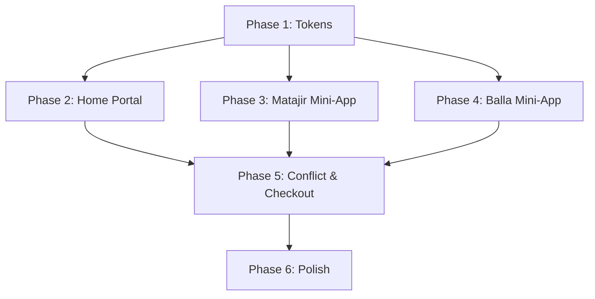

# Tasks: Super App Portal Revamp & Mini-App Cart Isolation

**Feature**: `1-home-portal-cart-isolation`
**Branch**: `1-home-portal-cart-isolation`
**Spec**: [spec.md](./spec.md)
**Plan**: [plan.md](./plan.md)
**Visual Reference**: [Stitch Project (Luqta - Iraqi Super App)](https://stitch.withgoogle.com/projects/1310454877615400065)
**Generated**: 2026-03-06

---

## Format: `[ID] [P?] [BLoC|RTL|DI|PERF] [Story] Description`

- **[P]**: Can run in parallel (different files, no shared state dependencies)
- **[Story]**: Which user story this task belongs to (US1–US4 per spec scenarios)
- **[BLoC]**: BLoC/Cubit class or state definition
- **[RTL]**: RTL layout, ARB localisation string, or IQD formatting
- **[DI]**: DI registration / `build_runner` re-generation
- **[PERF]**: Performance: image caching, pagination, const constructors
- **[TEST]**: Test file (unit, widget, bloc_test)

---

## Phase 1: Setup & Design Tokens (Industrial Pop)

**Purpose**: Update `AppTheme` and shared tokens to match the "Industrial Pop" aesthetic seen in Stitch.

- [ ] T001 [P] [RTL] Update `AppTheme` in `lib/core/theme/app_theme.dart` with Industrial Pop colors: `primary: 0xFFFFB703`, `secondary: 0xFFFB8500`, `surface: 0xFFF8F9FA`, `matajirBlue: 0xFF1565C0`, `ballaPurple: 0xFF7C4DFF`.
- [ ] T002 [P] [RTL] Define `matajirBlueSurface` (`0xFFE3F2FD`) and `ballaPurpleSurface` (`0xFFEDE7F6`) in `AppTheme` for card backgrounds as seen in Stitch.
- [ ] T003 [P] [DI] Run `dart run build_runner build --delete-conflicting-outputs` to ensure all typed cubits (`MatajirCartCubit`, `BallaCartCubit`) are correctly wired.

**Checkpoint ✅**: `AppTheme` reflects Stitch's colors. `flutter analyze` passes.

---

## Phase 2: User Story 1 — Home Portal (Industrial Pop Home)

**Story Goal**: Implement the revamped Home Portal including Global AppBar, Omnibox, Announcements, and Bento Grid.
**Test Criteria**: Home Page matches Stitch design `Luqta Industrial Pop Home`. Navigation to all 4 mini-apps via `go_router` works.

- [ ] T004 [US1] [RTL] Update `_HomeAppBar` in `lib/features/home/presentation/pages/home_page.dart` to match Stitch design: "Luqta" logo text (bold black), Escrow Wallet pill (`0xFFE8F5E9` bg, `0xFF2E7D32` text, `الرصيد: {amount} د.ع`).
- [ ] T005 [US1] [PERF] Refactor `OmniboxWidget` in `lib/features/home/presentation/widgets/home_components.dart` to use `0xFFF8F9FA` background and 12px rounded corners per Stitch design.
- [ ] T006 [P] [US1] [PERF] Update `AnnouncementsCarousel` in `lib/features/home/presentation/widgets/home_components.dart` to be edge-to-edge with high-quality photo support and bold typography overlays (Cairo/Inter).
- [ ] T007 [US1] [RTL] Redesign `BentoGrid` and `_BentoCard` in `lib/features/home/presentation/widgets/home_components.dart` to match Stitch 2x2 grid: use specific brand colors (Red Mazad, Blue Matajir, Orange Mustamal, Purple Balla) and icons (gavel, store, tag, box).
- [ ] T008 [US1] [PERF] Update `CuratedCarousel` in `lib/features/home/presentation/widgets/curated_carousel.dart` to include specific "context badges" (MTJR, BULK, BID, USED) as seen in Stitch curated lists.
- [ ] T009 [US1] [RTL] Add missing ARB keys for Bento Grid taglines: `miniAppMazadTagline` ("Live Bidding"), `miniAppMatajirTagline` ("Official Shops"), `miniAppMustamalTagline` ("Used Market"), `miniAppBallaTagline` ("Bulk Market") to `lib/l10n/arb/app_ar.arb` and `app_en.arb`.

**Checkpoint ✅ US1**: Home Portal reflects "Industrial Pop" design. Navigation is fluid via `context.go()`.

---

## Phase 3: User Story 2 — Matajir Mini-App (Official Shops Home)

**Story Goal**: Revamp the Matajir Mini-App home screen with verified merchants and professional retail product grid.
**Test Criteria**: `MatajirPage` matches Stitch design `Matajir Official Shops Home`. Cart badge updates independently.

- [ ] T010 [US2] [RTL] Update `MatajirPage` (or root page) in `lib/features/shop/presentation/pages/matajir_page.dart` to match Stitch: blue-themed categories, hero merchant banner (e.g., Samsung), and merchant grid with blue checkmarks.
- [ ] T011 [US2] [PERF] Implement `_MerchantCard` in `matajir_page.dart` for the Merchant Grid, showing circular logos and "Verified" status.
- [ ] T012 [US2] [RTL] Update product tiles in `matajir_page.dart` to use `Matajir Blue (#1565C0)` for "Add to Cart" buttons and Cairo bold prices.
- [ ] T013 [US2] Ensure `MatajirPage` AppBar uses `context.read<MatajirCartCubit>()` for the cart badge and navigates to `/matajir/cart`.

**Checkpoint ✅ US2**: Matajir Mini-App feels like a professional retail environment. Verified merchants are visible.

---

## Phase 4: User Story 3 — Balla Mini-App (Bulk Market & Cart)

**Story Goal**: Implement the Balla Mini-App home screen and specialized Bulk Shopping Cart.
**Test Criteria**: `BallaPage` matches Stitch design `Balla Bulk Market Home`. `BallaCartPage` shows weight-based shipping and logistics data.

- [ ] T014 [US3] [RTL] Update `BallaPage` in `lib/features/shop/presentation/pages/balla_page.dart` with Balla Purple (#7C4DFF) aesthetic, "Clothing Bales" categories, and gritty industrial banners.
- [ ] T015 [US3] [PERF] Implement `_BulkItemCard` in `balla_page.dart` showing "Price per Kg" and "Total Weight" data points per Stitch design.
- [ ] T016 [US3] [RTL] Build `lib/features/cart/presentation/pages/balla_cart_page.dart` (referencing `Balla Bulk Shopping Cart` Stitch design): weight-based pricing, logistics summary (Basra Hub), and high-contrast totals.
- [ ] T017 [US3] Wire `/balla/cart` route in `lib/core/router/app_router.dart` to the new `BallaCartPage` provided with `BallaCartCubit`.

**Checkpoint ✅ US3**: Balla Mini-App handles bulk logistics data and specialized shipping calculations visually.

---

## Phase 5: User Story 4 — Cart Conflict & Checkout (Revamped UX)

**Story Goal**: Refine the Cart Conflict flow and implement the Context-Isolated Checkout.
**Test Criteria**: Conflict sheet matches Stitch `Cart Conflict Resolution Sheet`. Matajir checkout shows the unique "Context Indicator Badge".

- [ ] T018 [US4] [RTL] Refine `CartConflictSheet` in `lib/features/cart/presentation/pages/cart_conflict_sheet.dart` to match Stitch: Amber warning triangle, "Incompatible Categories" header, and split brand logos (Blue vs Purple).
- [ ] T019 [US4] [BLoC] Ensure `CartConflictSheet` CTA buttons correctly trigger `clearCart()` then `addToCart()` for the new mini-app item.
- [ ] T020 [US4] [RTL] Update `CheckoutPage` in `lib/features/shop/presentation/pages/checkout_page.dart` to include the `Context Indicator Badge` (e.g., "Matajir Official Shopping Flow") when the context is `matajir`.
- [ ] T021 [US4] [PERF] Verify the "Confirm Purchase" button in `checkout_page.dart` uses `Matajir Blue (#1565C0)` or `Balla Purple (#7C4DFF)` depending on the active `CartCubit.appContext`.
- [ ] T022 [US4] Ensure all checkout payloads in `lib/features/shop/data/models/order_models.dart` (e.g., `BuyProductRequest`) carry the `app_context` string.

**Checkpoint ✅ US4**: Cross-context conflicts are handled gracefully via Stitch-inspired UI. Checkout is context-aware.

---

## Phase 6: Polish & Performance

**Purpose**: Final audit for constitution compliance, performance hardening, and production-ready i18n.

- [ ] T023 [P] [PERF] Add `const` constructors to all revamped widgets (`_HomeAppBar`, `_BentoCard`, `_MerchantCard`, `_BulkItemCard`, `CartConflictSheet`).
- [ ] T024 [P] [PERF] Audit all `CachedNetworkImage` usages in `HomePortal`, `Matajir`, and `Balla` to ensure 0 usage of `Image.network`.
- [ ] T025 [P] [RTL] Final ARB audit: Ensure `cartTitleMatajir` ("سلة المتاجر الرسمية") and `cartTitleBalla` ("سلة البالة") are correctly used in their respective Cart pages.
- [ ] T026 [P] Run `dart format .` and `flutter analyze` to ensure zero quality regressions.
- [ ] T027 [P] Perform a final smoke test on a physical/simulator device to verify `MaterialApp.router` deep linking.

**Checkpoint ✅**: App is 100% compliant with "Industrial Pop" Stitch designs and constitution standards.

---

## Dependency Graph

## Parallel Execution Opportunities

- **T001-T002** (Design Tokens) can run before any UI work.
- **Phase 2**, **Phase 3**, and **Phase 4** can run in parallel by different developers (Home, Matajir, Balla).
- **T023-T025** (Polish) can run in parallel once their respective stories are complete.

## Implementation Strategy

1. **Industrial Pop Tokens (MVP)**: Land T001-T002 first to ensure all subsequent UI work uses the correct HSL/Hex values.
2. **The Portal (US1)**: Implement the Home Portal as the primary entry point.
3. **Mini-App Isolation (US2–US4)**: Land Matajir and Balla refinements, finishing with the specialized Balla Cart and Isolated Checkout.
4. **Polish**: Final performance and i18n audit.
